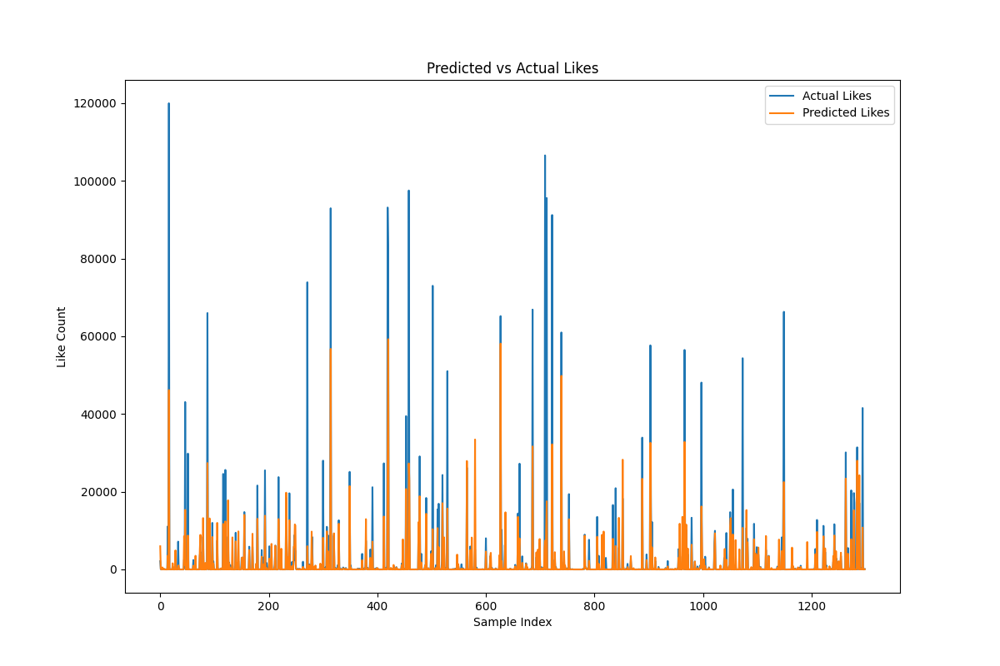
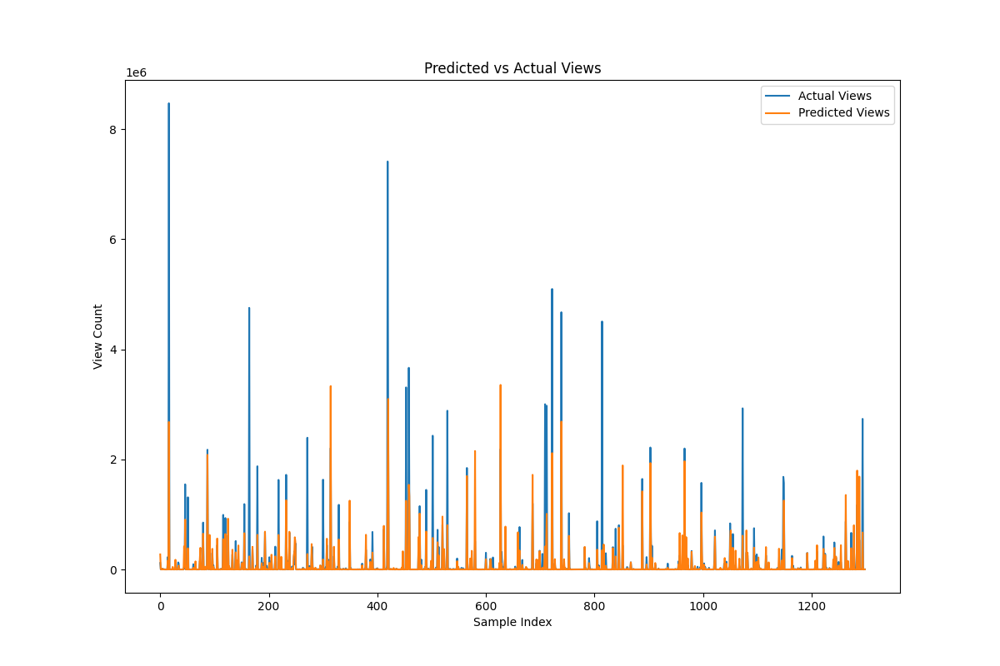
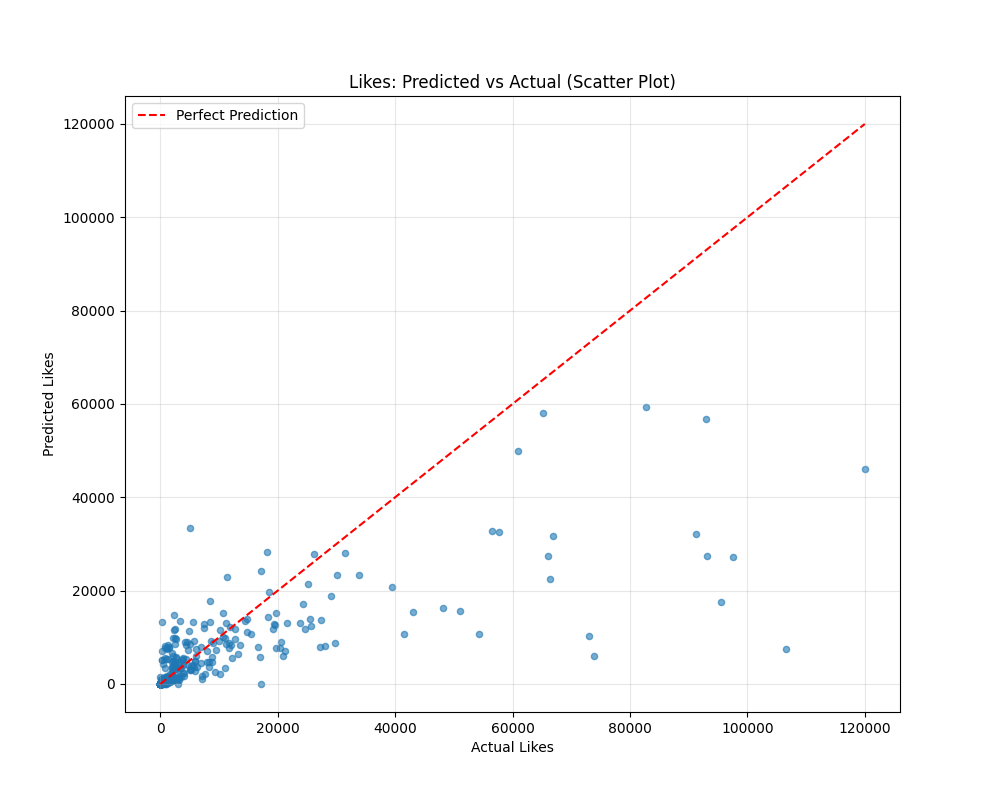
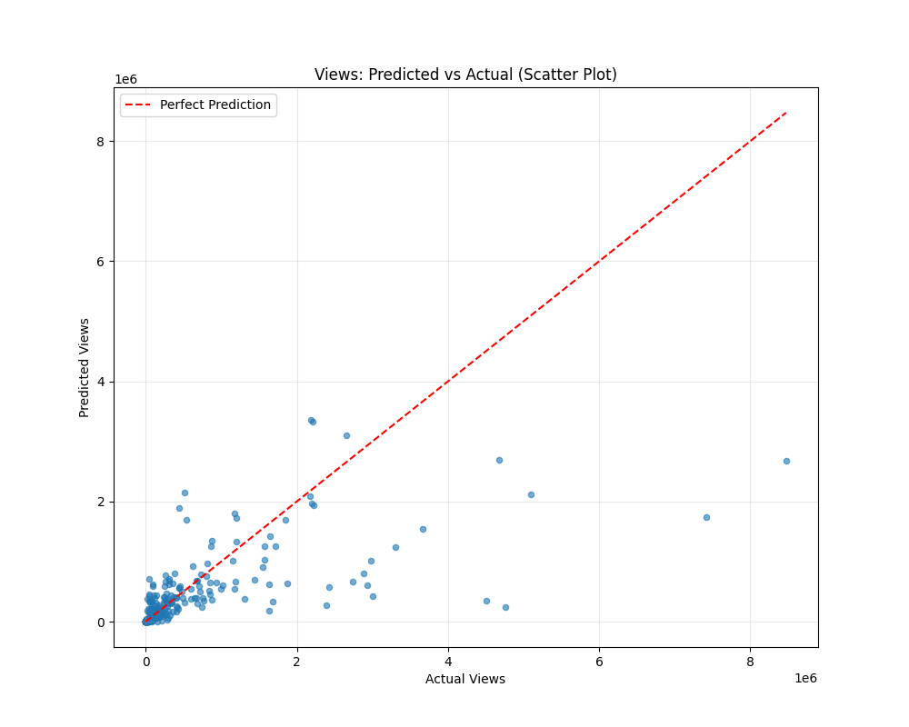
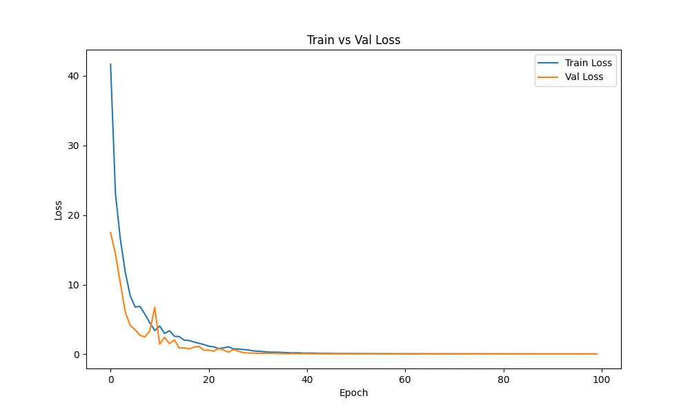
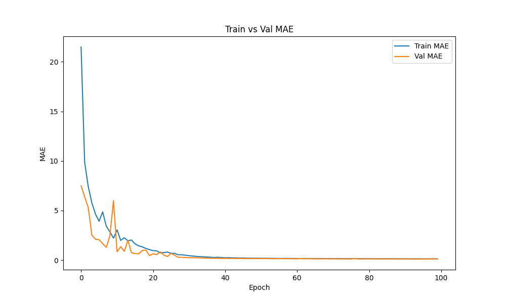

# Podcast Emotion Dynamics: Temporal Sentiment & Engagement Prediction

This project analyzes how emotions evolve over time in podcast conversations and predicts audience engagement (views and likes) using deep learning. It combines **transcript-based emotion detection** with **transformer-based engagement models**.

---

## Overview

Podcasts are rich sources of natural conversation. This project explores two key questions:

1. **Emotion Dynamics**  
   - How do emotions shift across a conversation?  
   - Where do significant **change points** occur in emotional tone?  

2. **Engagement Prediction**  
   - Can we predict a podcast’s **views and likes** from its **emotional trajectory** and metadata?  
   - How can models capture both **temporal signals** and **channel-level context**?  

The pipeline includes:
- Data collection from YouTube (metadata + transcripts)  
- Transcript cleaning and segmentation  
- Emotion detection with a fine-tuned DistilBERT model  
- Change point detection in emotional sequences  
- Dataset preprocessing and feature scaling  
- Engagement prediction using a **Transformer-based model** with static + sequential features  

---

## Project Structure

```
podcast-emotion-dynamics/
│
├── data/                     # Dataset (not included in repo, see Dataset section)
│   ├── raw/                  # Collected metadata + transcripts
│   └── processed/            # Processed emotions, features, datasets
│
├── models/                   # Saved models and scalers
│   ├── engagement_model.pt
│   └── engagement_model_attention.pt
│
├── scripts/                  # Core scripts
│   ├── data_collection/      # Query batching, collection, cleaning
│   ├── emotion_detection.py  # Segment transcripts, predict emotions
│   ├── emotion_change_point_detection.py
│   ├── preprocessing.py      # Merge metadata, emotions, scaling
│   ├── EngagementModel.py    # Transformer engagement model
│   ├── EngagementDataset.py  # Custom dataset class
│   ├── train_model.py        # Training loop
│   ├── test_model.py         # Evaluation and plots
│   └── utils.py              # Plotting utilities
│
├── notebooks/                # Jupyter notebooks for exploration
├── images/                   # Plots generated by training/testing
├── requirements.txt
├── README.md
└── LICENSE
```

---

## Dataset

The dataset is not stored in the repository due to size. A preprocessed dataset will be shared via external hosting:  
**[Download Dataset](https://huggingface.co/datasets/anshulraj10/youtube-podcast-data)**  

To use your own dataset:
1. Collect metadata: `python scripts/data_collection/collect_youtube.py`  
2. Fetch transcripts: `python scripts/fetch_transcript.py`  
3. Detect emotions: `python scripts/emotion_detection.py`  
4. Merge and preprocess: `python scripts/preprocessing.py`  

---

## Installation

Clone the repository and install dependencies:

```bash
git clone https://github.com/anshulraj10/podcast-emotion-dynamics.git
cd podcast-emotion-dynamics
python3 -m venv venv
source venv/bin/activate
pip install -r requirements.txt
```

Alternatively, using Conda:

```bash
conda create -n pedynamics python=3.10
conda activate pedynamics
pip install -r requirements.txt
```

---

## Usage

### 1. Data Collection
```bash
python scripts/data_collection/batch_scheduler.py
python scripts/data_collection/collect_youtube.py
python scripts/data_collection/fetch_transcript.py
python scripts/data_collection/clean_data.py
```

### 2. Emotion Processing
```bash
python scripts/process_emotions.py
python scripts/emotion_change_point_detection.py
```

### 3. Dataset Preprocessing
```bash
python scripts/preprocessing.py
```

### 4. Model Training
```bash
python scripts/train_model.py
```

### 5. Model Testing
```bash
python scripts/test_model.py
```

---

## Results

### Engagement Prediction Performance
**Test set (n = 1299 videos):**

| Metric         | Views           | Likes         |
|----------------|-----------------|---------------|
| RMSE           | 376,218         | 7,032         |
| MAE            | 68,736          | 1,432         |
| Log-space RMSE | 0.964           | 1.072         |
| Log-space MAE  | 0.695           | 0.505         |
| Coverage (p10–p90) | 0.897       | 0.911         |

### Predicted vs Actual (Samples)
 
 
<!--   
  
  
   -->

### Training Curves
 
<!--   
   -->

---

## Future Work
- Channel embeddings for identity effects  
- Mixture density heads for long-tail prediction  
- Improved handling of extreme viral outliers  
- Transfer learning to other domains (e.g., vlogs, interviews)  

---

## License
This project is released under the MIT License. See [LICENSE](LICENSE) for details.
